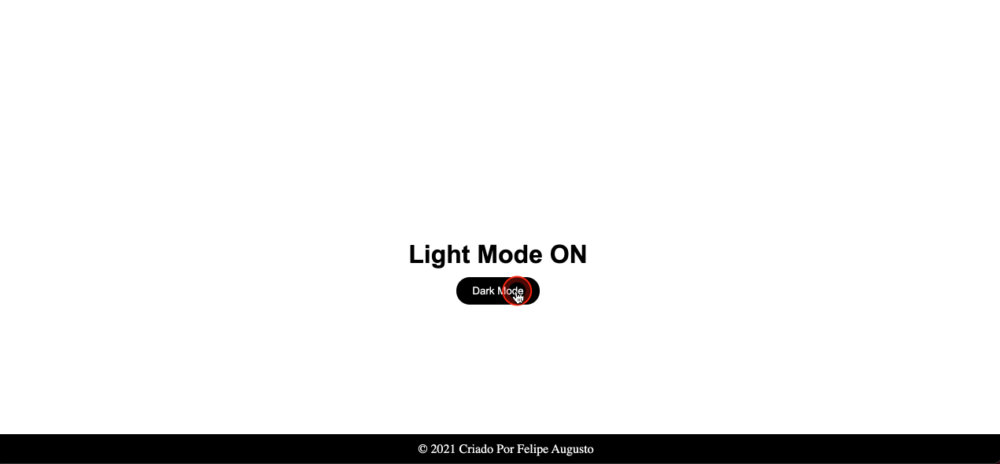

# Dark-mode-Light-Mode-

1. Crie uma estrutura básica de front-end do projeto (HTML, CSS e JS)
2. Copie o HTML e o CSS deste repositório
3. Crie um arquivo chamado scripts.jsna sua pastaassets/js
4. Elementos Selecione OS: h1, button, footerebody
5. Se os elementos possuirem a classe dark-mode, modifique seus estilos. Caso contrário, volte os estilos para o original

## Exemplo

